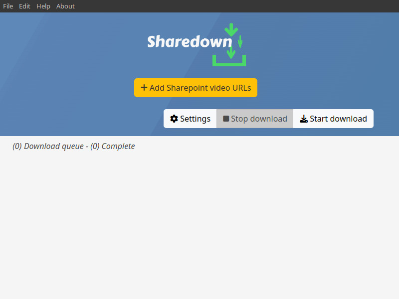

Sharedown is an Electron application to download Sharepoint videos, especially meant for students.

**We take NO responsibility for your actions, do not violate your tenant rules!**

### Requirements
* A recent version of FFmpeg
* YT-dlp - [releases](https://github.com/yt-dlp/yt-dlp/releases)
* Python 3
* A recent OS (Windows, Linux, or MacOS)

### Features
* Supports downloading with [FFmpeg](https://www.ffmpeg.org/) or [YT-dlp](https://github.com/yt-dlp/yt-dlp)
* Per-video settings
* Login modules to implement custom automatic login (see [Wiki](https://github.com/kylon/Sharedown/wiki))

### Install
* Download latest release from [here](https://github.com/kylon/Sharedown/releases/latest)
* Place Sharedown app in your preferred location

Default output folder is your OS _**Downloads**_ folder, or, in Linux, if not found, your _**Home**_ folder.

### Build

```
yarn install
yarn dist
```

### Run from source

```
yarn install
yarn start
```

### Sharedown Wiki
See [Sharedown Wiki](https://github.com/kylon/Sharedown/wiki) for more info or help!

---


