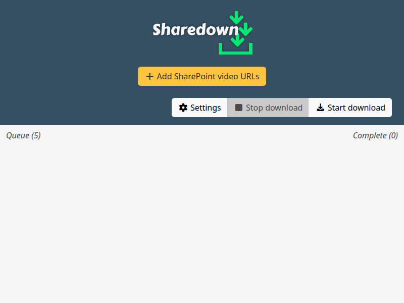

Sharedown is an Electron application to download Sharepoint videos, especially meant for students.

**We take NO responsibility for your actions, do not violate your tenant rules!**

### Sharedown Wiki
See [Sharedown Wiki](https://github.com/kylon/Sharedown/wiki) for more info or help!

### Requirements
* A recent version of FFmpeg
* YT-dlp - [releases](https://github.com/yt-dlp/yt-dlp/releases)
* Python 3
* A recent OS (Windows, Linux, or macOS)

### Releases
* Download latest build from [here](https://github.com/kylon/Sharedown/releases/latest)

### Build

Run the following commands in a terminal to build Sharedown.

```
$ git clone https://github.com/kylon/Sharedown.git
$ cd Sharedown
$ npm i
$ npm run dist
```

### Run from source

Run the following commands in a terminal to run Sharedown from source.

```
$ git clone https://github.com/kylon/Sharedown.git
$ cd Sharedown
$ npm i
$ npm start
```

---


